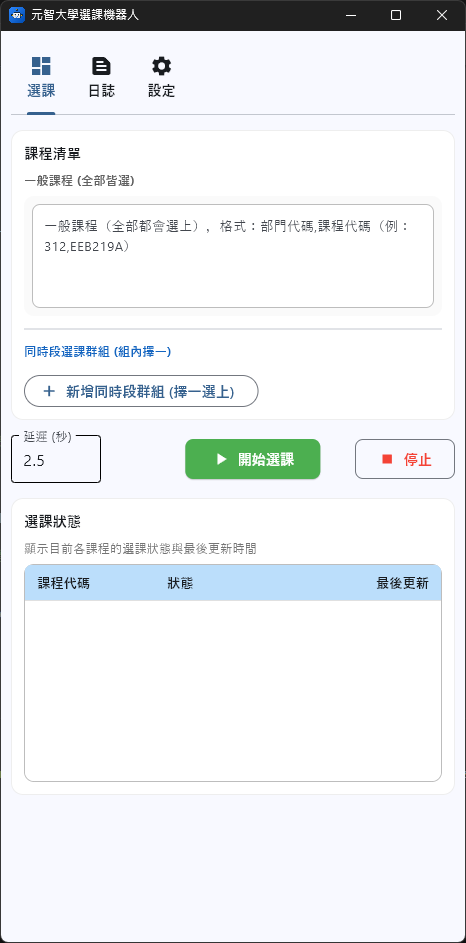
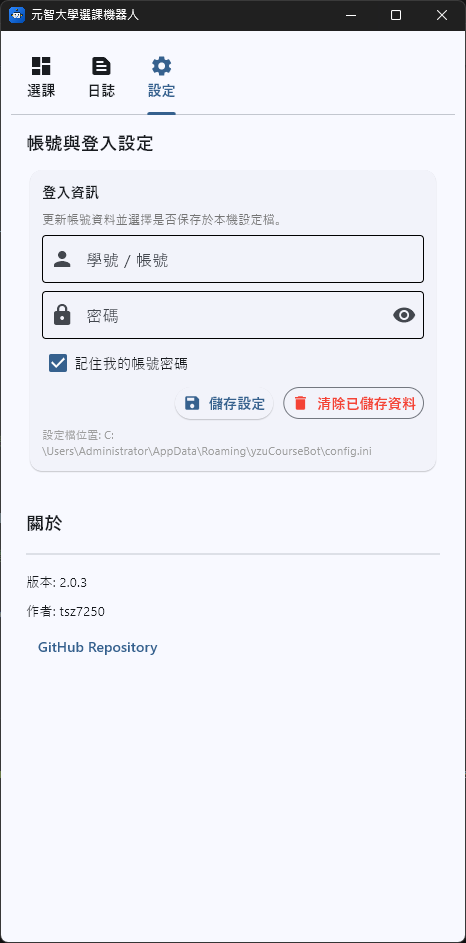

# yzuCourseBot 元智選課機器人





## 專案說明
本專案基於原始 yzuCourseBot 進行 fork 並針對 Windows、macOS、Android 與 iOS 環境進行優化與整合，主要包含：
- 更新套件相容性，支援 Python 3.12
- 修正各平台的依賴與打包問題
- 提供完整的 Windows、macOS、Android 與 iOS 安裝與使用指南
- 優化跨平台執行穩定性
- 提供預編譯的執行檔 (exe/app/apk/ipa)，降低使用門檻
- **選課邏輯**：基於 [原始 yzuCourseBot](https://github.com/Doem/yzuCourseBot) 進行 fork
- **跨平台支援**：支援 Windows、macOS、Android 與 iOS 平台
- **驗證碼識別**：基於 [CNN-model-for-YZU-cpatcha-OCR](https://github.com/Doem/CNN-model-for-YZU-cpatcha-OCR) 的 CNN 模型匯出為 `.onnx` 格式。手機版則透過 `mobile_app/export_weights.py` 將 `.onnx` 轉換為 `.npz` 格式，以提升執行效能並降低依賴套件。

此版本針對跨平台環境進行相容性調整，提供更穩定的執行體驗。

## Remind
請斟酌使用本機器人程式，並自行負責使用後所造成的損失!

## 系所一覽表（依學院分區塊）

<details>
<summary>工程學院</summary>

| 系所編號 | 系所名稱 | 系所編號 | 系所名稱 |
|----------|----------|----------|----------|
| 300 | 工程學院 | 302 | 機械工程學系學士班 |
| 303 | 化學工程與材料科學學系學士班 | 305 | 工業工程與管理學系學士班 |
| 309 | 工程學院英語學士班 | 320 | 淨零碳排永續發展學士後專班 |
| 322 | 機械工程學系碩士班 | 323 | 化學工程與材料科學學系碩士班 |
| 325 | 工業工程與管理學系碩士班 | 330 | 先進能源碩士學位學程 |
| 340 | 智慧電子產品製造碩士產學專班 | 352 | 機械工程學系博士班 |
| 353 | 化學工程與材料科學學系博士班 | 355 | 工業工程與管理學系博士班 |

</details>

<details>
<summary>管理學院</summary>

| 系所編號 | 系所名稱 | 系所編號 | 系所名稱 |
|----------|----------|----------|----------|
| 500 | 管理學院 | 505 | 管理學院學士班 |
| 530 | 管理學院經營管理碩士班 | 531 | 管理學院財務金融暨會計碩士班 |
| 532 | 管理學院管理碩士在職專班 | 554 | 管理學院博士班 |

</details>

<details>
<summary>人文社會學院</summary>

| 系所編號 | 系所名稱 | 系所編號 | 系所名稱 |
|----------|----------|----------|----------|
| 600 | 人文社會學院 | 601 | 應用外語學系學士班 |
| 602 | 中國語文學系學士班 | 603 | 藝術與設計學系學士班 |
| 604 | 社會暨政策科學學系學士班 | 608 | 人文社會學院英語學士班 |
| 621 | 應用外語學系碩士班 | 622 | 中國語文學系碩士班 |
| 623 | 藝術與設計學系(藝術與設計管理碩士班) | 624 | 社會暨政策科學學系碩士班 |
| 656 | 文化產業與文化政策博士學位學程 |  |  |

</details>

<details>
<summary>資訊學院</summary>

| 系所編號 | 系所名稱 | 系所編號 | 系所名稱 |
|----------|----------|----------|----------|
| 700 | 資訊學院 | 304 | 資訊工程學系學士班 |
| 701 | 資訊管理學系學士班 | 702 | 資訊傳播學系學士班 |
| 705 | 資訊學院英語學士班 | 721 | 資訊管理學系碩士班 |
| 722 | 資訊傳播學系碩士班 | 723 | 資訊社會學碩士學位學程 |
| 724 | 資訊工程學系碩士班 | 725 | 生物與醫學資訊碩士學位學程 |
| 751 | 資訊管理學系博士班 | 754 | 資訊工程學系博士班 |

</details>

<details>
<summary>電機通訊學院</summary>

| 系所編號 | 系所名稱 | 系所編號 | 系所名稱 |
|----------|----------|----------|----------|
| 800 | 電機通訊學院 | 310 | 電機通訊學院英語學士班 |
| 311 | 電機系甲組 | 312 | 電機系乙組 |
| 313 | 電機系丙組 | 326 | (113學年起碩專課程)電機工程學系碩士班 |
| 326 | (106學年以前)電機工程學系碩士班 | 331 | 電機碩甲組 |
| 332 | 電機碩乙組 | 333 | 電機碩丙組 |
| 359 | 電機博甲組 | 360 | 電機博乙組 |
| 361 | 電機博丙組 | 301 | (106學年以前)電機工程學系學士班 |
| 307 | (106學年以前)通訊工程學系學士班 | 308 | (106學年以前)光電工程學系學士班 |
| 327 | (106學年以前)通訊工程學系碩士班 | 328 | (106學年以前)光電工程學系碩士班 |
| 356 | (106學年以前)電機工程學系博士班 | 357 | (106學年以前)通訊工程學系博士班 |
| 358 | (106學年以前)光電工程學系博士班 |  |  |

</details>

<details>
<summary>醫護學院</summary>

| 系所編號 | 系所名稱 | 系所編號 | 系所名稱 |
|----------|----------|----------|----------|
| A00 | 醫護學院 | 329 | 生物科技與工程研究所碩士班 |
| A11 | 護理學系學士班 | A21 | 醫學研究所碩士班 |

</details>

<details>
<summary>其他單位</summary>

| 系所編號 | 系所名稱 | 系所編號 | 系所名稱 |
|----------|----------|----------|----------|
| 901 | 通識教學部 | 903 | 軍訓室 |
| 904 | 體育室 | 906 | 國際語言文化中心 |
| 907 | 全球事務處 | 908 | 磨課師 |
| 910 | 大專院校人工智慧學程聯盟 | 909 | 探索跨域 |

</details>

## 使用方式

### 方式一：直接下載執行檔 (Windows / macOS / Android / iOS)

1. 前往 [Releases](https://github.com/tsz7250/yzuCourseBot/releases) 頁面
2. 根據您的作業系統下載對應的檔案：
   - **Windows**: 下載 `YZUCourseBot-Windows.zip`，解壓縮後雙擊 `元智選課機器人.exe`
   - **macOS**: 下載 `YZUCourseBot-macOS.zip`，解壓縮後雙擊 `元智選課機器人.app`
     > ⚠️ **macOS 安全提示**：首次開啟時請務必**右鍵點擊** `元智選課機器人.app` 並選擇「打開」，以繞過未簽署應用程式的警告。或者在終端機執行：`xattr -rd com.apple.quarantine 元智選課機器人.app`
   - **Android**: 下載 `YZUCourseBot-Android.apk`，下載後點擊安裝（若出現「未知的來源」警告請允許安裝）。
   - **iOS**: 下載 `YZUCourseBot-iOS.ipa`，需透過 [iLoader](https://github.com/nab138/iloader) 等工具側載 (Sideload) 安裝至手機，並至「設定」信任開發者憑證。
3. 輸入帳號、密碼，並於「課程清單」中填入「一般課程」或新增「同時段選課群組」（同群組課程擇一選上即跳過其餘），點擊「開始選課」

各平台詳細說明請參考：
- [電腦版(Windows/macOS)說明](GUI/GUI使用說明.md)
- [手機版(Android/iOS)說明](mobile_app/README.md)


### 方式二：手動執行 Python 版本

> ⚠️ **前置需求：需要安裝 Python 3.12 環境**  
> 完整安裝流程（包含 Python 安裝、套件安裝等）請參考 [INSTALL.md](INSTALL.md)
> 
> **macOS 使用者注意**：如果您使用的是 Apple Silicon (M1/M2/M3) 且希望啟用 GPU 加速，建議在安裝 `requirements.txt` 後，額外執行 `pip install tensorflow-metal`。

安裝完成後，可選擇以下兩種執行方式：

#### 2-A. GUI 圖形介面版本

執行 GUI 版本：
```bash
python GUI/yzuCourseBot_GUI.py
```

在圖形介面中輸入帳號、密碼，並依需求填寫一般課程或新增「同時段選課群組」，點擊「開始選課」

若要自行打包：
```bash
# 前往 GUI 目錄
cd GUI

# Windows
.\build.bat

# macOS
pyinstaller yzuCourseBot_macos.spec
```

打包後的執行檔位於 `dist` 資料夾內。

#### 2-B. 命令列版本

1. 新增 `accounts.ini` 存放Portal帳密的檔案，格式如下:
```ini
[Default]
Account= your account
Password= your password
```

2. 修改 `yzuCourseBot.py` 中的 `coursesList` 變數以新增想選的課程清單：

- **一般選課**（每門課皆會獨立嘗試加選）：
  ```python
  coursesList = [
      '304,CS352A', 
      '901,LS239A', 
      '304,CS354A'
  ]
  ```

- **同時段群組選課**（同群組課程擇一選上，即自動跳過該組其餘課程）：
  可以使用 `'---'` 字串來分隔不同的選課群組，或直接使用巢狀清單（Nested List）：
  ```python
  # 使用 '---' 分隔
  coursesList = [
      '304,CS352A',
      '304,CS352B',
      '---',
      '901,LS239A',
      '304,CS354A'
  ]

  # 或使用巢狀清單
  coursesList = [
      ['304,CS352A', '304,CS352B'],
      ['901,LS239A', '304,CS354A']
  ]
  ```

**304**：為系所編號

**CS352A**：為課程編號加上班級編號，CS352 + A

以上資訊都能在課程查詢網站或是選課系統中得知的訊息

3. 執行 `yzuCourseBot.py`
```bash
python yzuCourseBot.py
```
